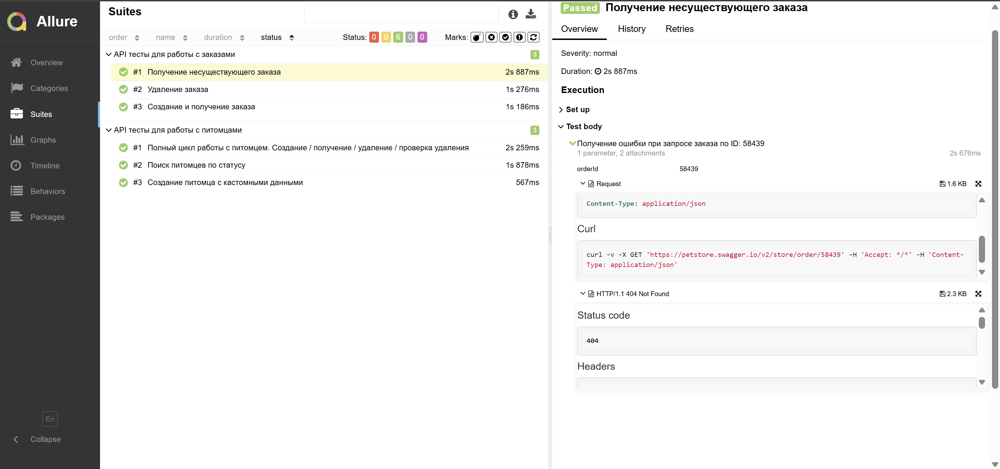
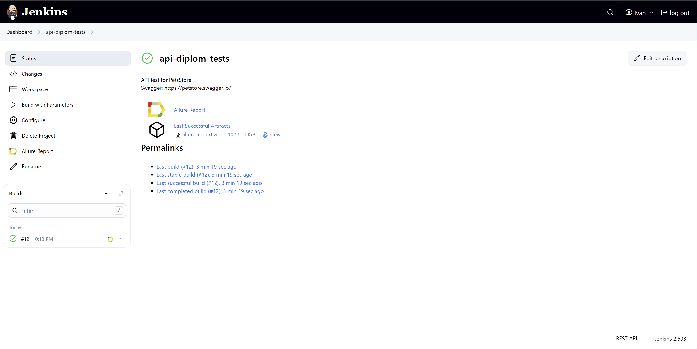
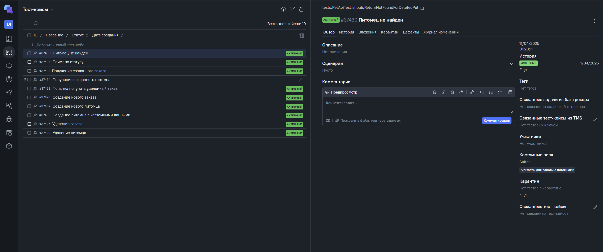

# PetStore API Automation Framework (Gradle)

Фреймворк для автоматизированного тестирования API PetStore с поддержкой Allure-отчетов (сборка Gradle).

### Стек технологий

<p align="center">
  <a href="https://www.jetbrains.com/idea/" target="_blank"></a>
  <a href="https://www.java.com" target="_blank"></a>
  <a href="https://selenide.org" target="_blank"></a>
  <a href="https://aerokube.com/selenoid/" target="_blank"></a>
  <a href="https://docs.qameta.io/allure/" target="_blank"></a>
  <a href="https://docs.qameta.io/allure-testops/" target="_blank"></a>
  <a href="https://gradle.org" target="_blank"></a>
  <a href="https://junit.org/junit5/" target="_blank"></a>
  <a href="https://github.com" target="_blank"></a>
  <a href="https://www.jenkins.io" target="_blank"></a>
  <a href="https://telegram.org" target="_blank"></a>
</p>

## 📌 Особенности

- **Полное покрытие API**: CRUD операции для сущностей Pet и Order
- **Gradle-сборка**: Оптимизированная конфигурация зависимостей
- **Инструменты**:
    - RestAssured для HTTP-запросов
    - Lombok для моделей
    - Allure для отчетности
- **Логирование**: Кастомизированные Allure-шаблоны для запросов/ответов
- **CI-готовность**: Встроенная поддержка видео-фиксации (Selenoid)
- **Cтруктура**:
  ```text
  src/
  ├── main/
  │   └── java/
  │       ├── data/            # Фабрики тестовых данных
  │       ├── helpers/         # Allure-утилиты
  │       ├── model/           # DTO-модели
  │       ├── steps/           # API-клиенты
  │       ├── specs/           # Спецификации
  │       └── tests/           # Тесты
  └── resources/
      └── tpl/                 # Allure-шаблоны
  ```

## 🔍 Ключевые сущности

### Модели
- `Pet` - с вложенными `Category` и `Tag`
- `Order` - модель заказа
- `ApiResult` - универсальный response

### Сервисы
| Класс             | Методы                             |
|-------------------|------------------------------------|
| `PetApiService`   | CRUD + поиск по статусу питомца    |
| `OrderApiService` | Создание/получение/удаление заказа |

### Тесты
- **PetApiTest**: 3 сценария
- **OrderApiTest**: 3 сценария


## 🛠 Технологический стек

| Компонент       | Версия    | Gradle-артефакт |
|-----------------|-----------|----------------|
| Java            | 17        | Встроенная через toolchain |
| RestAssured     | 5.3.1     | `implementation "io.rest-assured:*:$restAssuredVersion"` |
| Allure          | 2.21.0    | `implementation "io.qameta.allure:*:$allureVersion"` |
| JUnit 5         | 5.11.2    | `testImplementation "org.junit.jupiter:*:5.11.2"` |
| Selenide        | 7.5.1     | `testImplementation "com.codeborne:selenide:$selenideVersion"` |

## 🚀 Запуск тестов

**Стандартный запуск:**
```bash
gradle clean test
```

**Генерация Allure-отчета:**
```bash
gradle allureServe
```

## 🔧 Настройка Gradle

Ключевые части `build.gradle`:
```groovy
plugins {
    id 'java-library'
    id 'io.qameta.allure' version '2.11.2'
    id "io.freefair.lombok" version '6.0.0-m2'
}

dependencies {
  testImplementation(
          "com.codeborne:selenide:$selenideVersion",
          "io.qameta.allure:allure-selenide:$allureVersion",
          "io.rest-assured:rest-assured:$restAssuredVersion",
          "io.rest-assured:json-schema-validator:$restAssuredVersion",
          "io.qameta.allure:allure-rest-assured:$allureVersion",
          "org.junit.jupiter:junit-jupiter:5.11.2",
          "org.slf4j:slf4j-simple:2.0.7",
          "org.assertj:assertj-core:3.26.0"
  )
}

tasks.withType(Test) {
  useJUnitPlatform()
  testLogging {
    lifecycle {
      events "started", "skipped", "failed", "standard_error", "standard_out"
      exceptionFormat "short"
    }
  }
}
```

## 📊 Отчеты и интеграции

### Allure Report

**Ссылка:** [Открыть полный отчет Allure](https://jenkins.autotests.cloud/job/api-diplom-tests/allure/)

### Jenkins Pipeline

**Ссылка:** [Открыть Jenkins проект](https://jenkins.autotests.cloud/job/api-diplom-tests/)

### Allure TestOps

**Ссылка:** [Открыть Allure TestOps](https://allure.autotests.cloud/project/4710/test-cases)

### Telegram Notifications
  